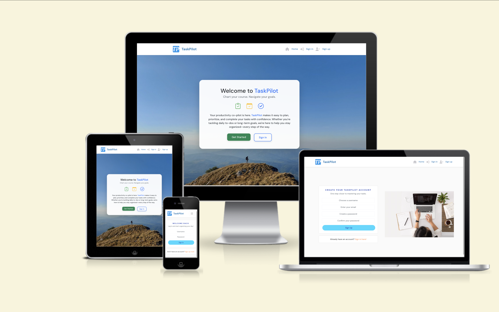

# TaskPilot 🛫

TaskPilot is a full-stack task and notes management application built with **React** (frontend) and **Django REST Framework** (backend). Users can manage tasks, write notes, and contact support, with authentication and responsive UI.


---

## 🌐 Live Demo

🔗 [Deployed App on Heroku](https://taskpilot-backend-6ee557f05c5b.herokuapp.com/)

---

## 📦 Tech Stack

- **Frontend:** React, React-Bootstrap, Axios
- **Backend:** Django, Django REST Framework, dj-rest-auth, SimpleJWT
- **Auth:** JWT-based authentication
- **Deployment:** Heroku (backend + frontend build)

---

## ✨ Features

- User registration and login
- Create, update, and delete tasks
- Add and manage personal notes
- Contact form for user support
- Responsive design for mobile and desktop
- Protected routes based on authentication
- Combined deployment: React build served from Django

---

## 🛠️ Installation

### 1. Clone the backend repo (contains everything now)

```bash
git clone https://github.com/Alisha98A/taskpilot-backend.git
cd taskpilot-backend

---
## Technologies used

https://ui.dev/amiresponsive?