## Testing

# Table of Contents

- [Manual Testing](#manual-testing)
  - [User Stories and Epics](#user-stories-and-epics)
- [Validator Testing](#validator-testing)
  - [JSX](#jsx)
  - [HTML](#html)
  - [CSS](#css)
- [Automated Testing](#automated-testing)
  - [Backend API Automated Testing](#backend-api-automated-testing)
- [CSS Validation Testing](#css-validation-testing)
  - [Process](#process)
  - [How to Run](#how-to-run)
  - [Outcome](#outcome)
- [Fix for Deprecated Media Feature Warning](#fix-for-deprecated-media-feature-warning)
- [Bug: Favicon and Static File Path Errors on Deployment](#bug-favicon-and-static-file-path-errors-on-deployment)
  - [Problem](#problem)
  - [Cause](#cause)
  - [Solution](#solution)

### Manual testing

<details>
<summary> User Stories and Epics</summary>  
<br>

---

### **EPIC – Task Management**

| Goals | How are they achieved? | Comment |
| --- | --- | --- |
| As an authenticated user, I want to create a new task so I can manage my responsibilities | API endpoint `/api/tasks/` with POST method, using TaskSerializer | |
| As an authenticated user, I want to view a list of my tasks | API endpoint `/api/tasks/` with GET method filtered by user | |
| As an authenticated user, I want to view task details including attached notes | Detail view at `/api/tasks/<id>/` returns nested notes via TaskWithNotesSerializer | |
| As an authenticated user, I want to update a task | API endpoint `/api/tasks/<id>/` with PUT method, protected by IsOwnerOnly permission | |
| As an authenticated user, I want to delete a task I no longer need | DELETE request to `/api/tasks/<id>/` | |
| As an authenticated user, I want tasks to automatically be marked as overdue | Overridden `save()` method on Task model checks due date | |

---

### **EPIC – Notes System**

| Goals | How are they achieved? | Comment |
| --- | --- | --- |
| As an authenticated user, I want to create a note attached to a task | API POST to `/api/notes/`, task is required and must belong to the user | |
| As an authenticated user, I want to view all my notes | GET request to `/api/notes/` only returns notes by the current user | |
| As an authenticated user, I want to edit a note | PUT/PATCH request to `/api/notes/<id>/` | |
| As an authenticated user, I want to delete a note I no longer need | DELETE request to `/api/notes/<id>/` | |

---

### **EPIC – Authentication & Session Management**

| Goals | How are they achieved? | Comment |
| --- | --- | --- |
| As a new user, I want to register for an account | Endpoint `/api/dj-rest-auth/registration/` using dj-rest-auth | |
| As a returning user, I want to log in and receive a JWT | Endpoint `/api/dj-rest-auth/login/`, returns access and refresh tokens | |
| As a logged-in user, I want to log out securely | Endpoint `/api/dj-rest-auth/logout/`, using `logout_route` view | |
| As a user, I want to refresh my JWT to stay logged in | Endpoint `/api/token/refresh/` | |

---

### **EPIC – Contact & Feedback**

| Goals | How are they achieved? | Comment |
| --- | --- | --- |
| As a user, I want to submit a message for support | POST request to `/api/contact/` | |
| As an admin, I want to view all submitted messages | GET request to `/api/contact/messages/`, protected with `IsAdminUser` | |

---

### **EPIC – Permissions and Security**

| Goals | How are they achieved? | Comment |
| --- | --- | --- |
| As an authenticated user, I want to only access my own data | All task/note queries filter by request.user; permissions enforced | |
| As an unauthorized user, I should be blocked from others’ content | Custom permission class `IsOwnerOnly` applied to detail views | |
| As an admin, I want to access all contact messages | Contact list view uses `IsAdminUser` permission | |

</details>

_<span style="color: blue;">[Back to Content](#table-of-contents)</span>_


## Validator Testing

### JSX

Throughout the development process, I have consistently used **Prettier** and **ESLint** to ensure that the JSX and JavaScript code meets high standards of readability, consistency, and correctness.

- **Prettier** automatically formats the code, enforcing a uniform style such as indentation, line length, quotes, and spacing. This reduces style debates and keeps the codebase clean.
- **ESLint** statically analyzes the code to catch potential errors, enforce best practices, and maintain coding conventions. It helps detect issues like unused variables, incorrect prop types, and potential runtime errors.
- The project is configured to run these tools automatically during development, including integration with editors and pre-commit hooks, making it easy to maintain code quality continuously.
- Using Prettier and ESLint together helps improve developer productivity by providing immediate feedback and ensuring that code adheres to the agreed-upon standards.
- The setup also includes React-specific linting rules to cover common pitfalls and patterns in React development.
- This approach contributes to a maintainable, scalable, and bug-minimized frontend codebase.

### HTML

I validated my HTML pages using the W3 Nu HTML Checker. They came back with no errors, only pointers about redundant trailing slashes left by React. Please check the results for each page below.

<details>
<summary>HTML validation results</summary>

[Homepage](https://validator.w3.org/nu/?doc=https%3A%2F%2Ftaskpilot-backend-6ee557f05c5b.herokuapp.com%2F)
[Sign in Page](https://validator.w3.org/nu/?doc=https%3A%2F%2Ftaskpilot-backend-6ee557f05c5b.herokuapp.com%2Fsignin)
[Sign up Page](https://validator.w3.org/nu/?doc=https%3A%2F%2Ftaskpilot-backend-6ee557f05c5b.herokuapp.com%2Fsignup)
[Dashboard](https://validator.w3.org/nu/?doc=https%3A%2F%2Ftaskpilot-backend-6ee557f05c5b.herokuapp.com%2Fdashboard)
[Task list page](https://validator.w3.org/nu/?doc=https%3A%2F%2Ftaskpilot-backend-6ee557f05c5b.herokuapp.com%2Ftasks)
[Create task page](https://validator.w3.org/nu/?doc=https%3A%2F%2Ftaskpilot-backend-6ee557f05c5b.herokuapp.com%2Ftasks%2Fcreate)
[Edit task](https://validator.w3.org/nu/?doc=https%3A%2F%2Ftaskpilot-backend-6ee557f05c5b.herokuapp.com%2Ftasks%2F24%2Fedit)
[Task detail](https://validator.w3.org/nu/?doc=https%3A%2F%2Ftaskpilot-backend-6ee557f05c5b.herokuapp.com%2Ftasks%2F6)
[Notes list page](https://validator.w3.org/nu/?doc=https%3A%2F%2Ftaskpilot-backend-6ee557f05c5b.herokuapp.com%2Fnotes)
[Note detail](https://taskpilot-backend-6ee557f05c5b.herokuapp.com/notes/79)
[Note edit](https://validator.w3.org/nu/?doc=https%3A%2F%2Ftaskpilot-backend-6ee557f05c5b.herokuapp.com%2Fnotes%2Fid%2Fedit)
[Note delete](https://validator.w3.org/nu/?doc=https%3A%2F%2Ftaskpilot-backend-6ee557f05c5b.herokuapp.com%2Fnotes%2Fid%2Fdelete)
[Contact page](https://validator.w3.org/nu/?doc=https%3A%2F%2Ftaskpilot-backend-6ee557f05c5b.herokuapp.com%2Fcontact)

</details>

_<span style="color: blue;">[Back to Content](#table-of-contents)</span>_


### CSS

_<span style="color: blue;">[Back to Content](#table-of-contents)</span>_

To ensure the CSS files in the project adhere to web standards and maintain high quality, I used the [W3C CSS Validator](http://jigsaw.w3.org/css-validator/validator) service through an automated approach.

- I created a Node.js script that reads each CSS and CSS module file in the project.
- The script sends the CSS content programmatically to the W3C CSS Validator API using the `css-validator` npm package.
- Validation results are parsed and logged, clearly showing errors and warnings for each CSS file.
- To keep the focus on critical issues, I filtered out known vendor-specific warnings and deprecated but necessary browser-specific properties.
- This process helps catch syntax errors, deprecated properties, and potential compatibility problems early.
- Fixes were applied where validation errors were found, ensuring the CSS remains clean, standard-compliant, and cross-browser compatible.
- Running this script is simple and automated, making it easy to maintain CSS quality throughout development.

By integrating this CSS validation into the workflow, the project benefits from a consistent, maintainable stylesheet base that adheres to official CSS specifications.


### Python

All Python files in the project were validated and formatted according to the **PEP 8** style guide. This ensures that the code follows the official Python coding standards for readability and consistency.

- The validation was performed using the [PEP8CI](https://pep8ci.herokuapp.com/#) online tool, which checks the code for style violations and provides immediate feedback.
- Any detected issues were corrected to maintain a clean, uniform codebase free of PEP 8 errors and warnings.
- This process helps improve code quality, maintainability, and reduces the likelihood of bugs caused by inconsistent formatting.
- Below is an example screenshot of the admin module after successful validation and cleanup:

<details>
<summary>Main project directory</summary>  
<br>

Main project directory
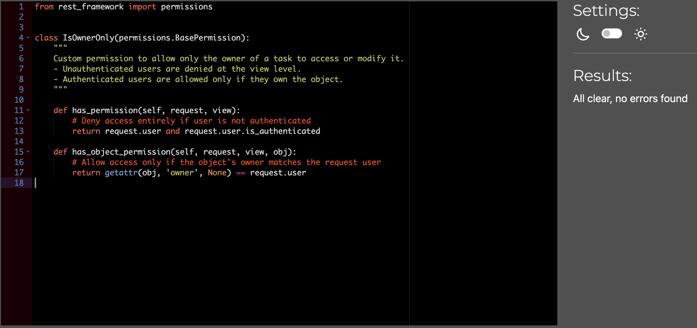
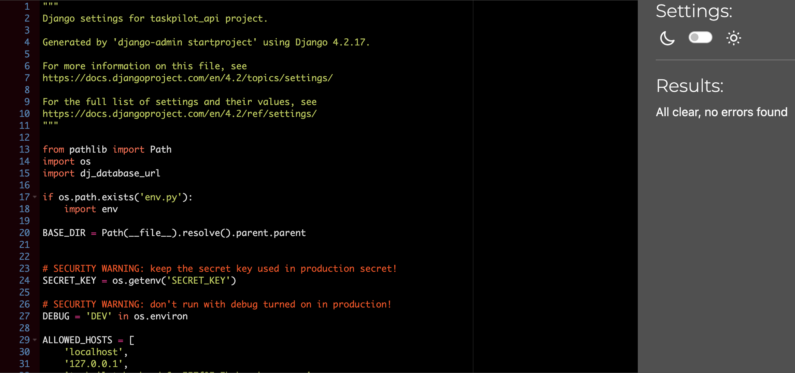
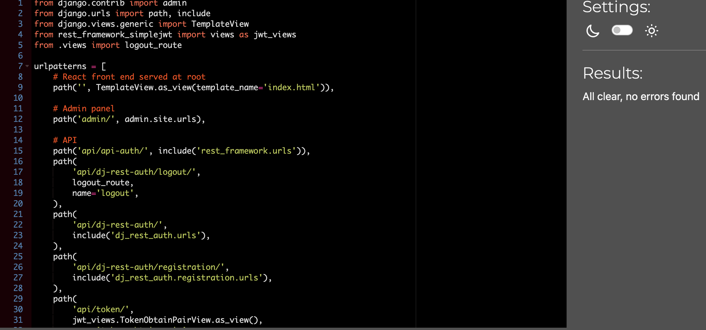
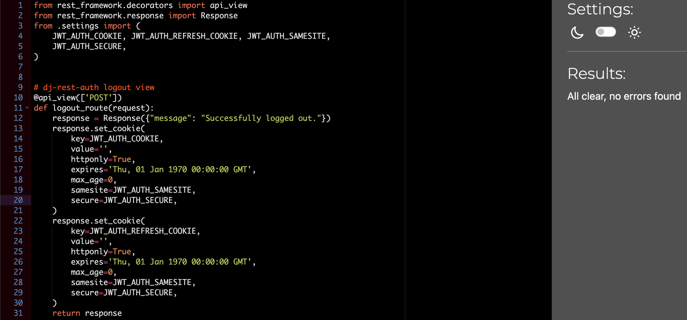
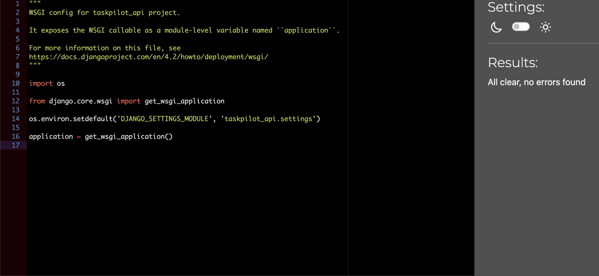

</details>


<details>
<summary>App directory</summary>  
<br>

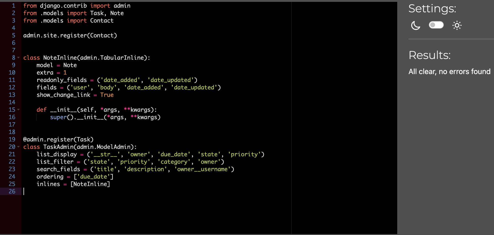

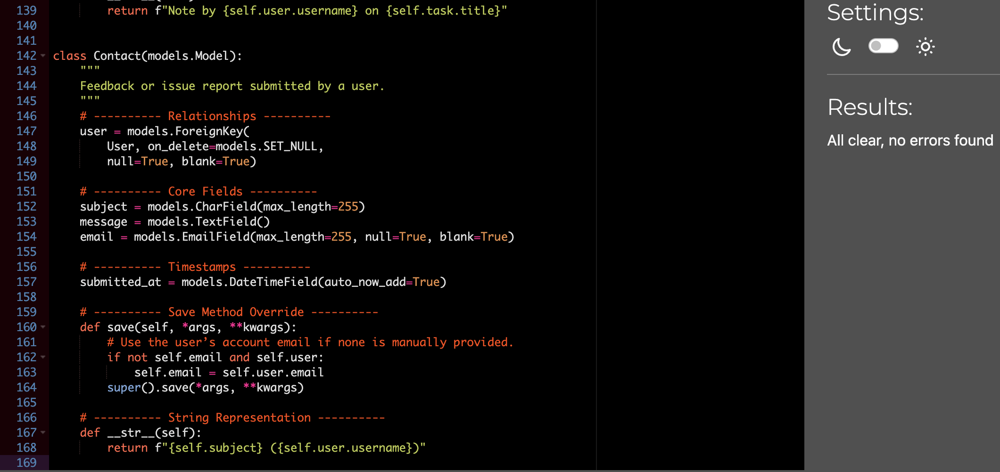
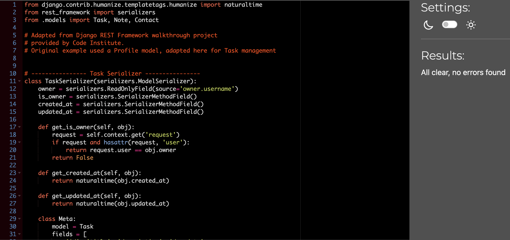
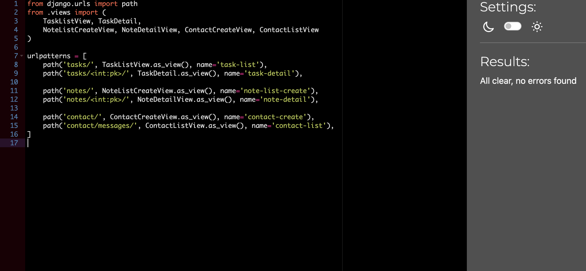
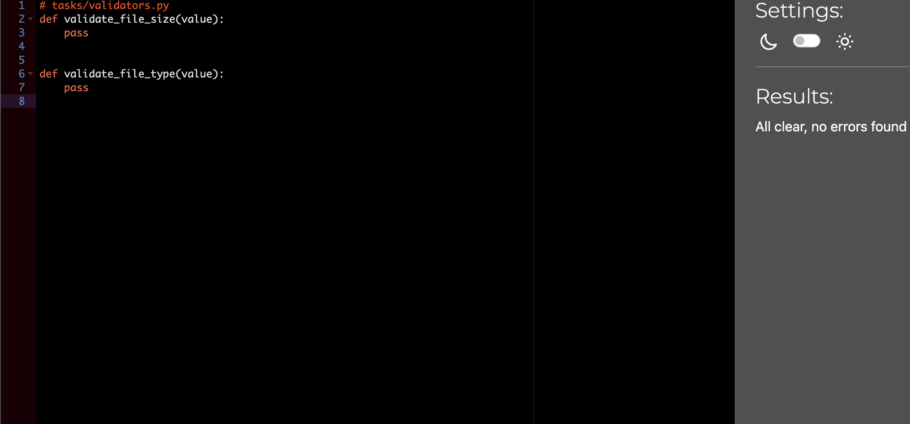

</details>


### Lighthouse

[Lighthouse](https://developer.chrome.com/docs/lighthouse/overview/) is an open-source tool developed by Google that audits web applications for:

- **Performance**: How fast your page loads and becomes interactive.
- **Accessibility**: Ensures usability for users with disabilities, based on WCAG guidelines.
- **Best Practices**: Checks for use of modern and secure web development practices.
- **SEO**: Evaluates how discoverable your app is by search engines.

I used Lighthouse to test multiple pages of the **TaskPilot** application on both **mobile** and **desktop**. This helped identify performance bottlenecks, accessibility improvements, and SEO enhancements.

#### Observations

- The **homepage** results are provided as images below.
- **Desktop pages** scored consistently well, especially in SEO and Best Practices (96–100).
- Some **mobile pages** scored lower in **Performance** due to render-blocking scripts, large component trees, or slower time-to-interactive.
- **Accessibility** remained high across the board, reflecting proper semantic structure and good contrast ratios.
- **Best Practices** and **SEO** scored highly throughout, ensuring modern code standards and discoverability.

#### Homepage Lighthouse Results

  


---

#### Full Lighthouse Test Results

| Page                 | Performance | Accessibility | Best Practices | SEO  |
|----------------------|-------------|----------------|----------------|------|
| Home (Mobile)        | 70          | 100            | 96             | 100  |
| Home (Desktop)       | 94          | 95             | 96             | 100  |
| Sign In (Mobile)     | 70          | 95             | 96             | 100  |
| Sign In (Desktop)    | 92          | 95             | 96             | 100  |
| Sign Up (Mobile)     | 64          | 95             | 96             | 100  |
| Sign Up (Desktop)    | 92          | 95             | 96             | 100  |
| Dashboard (Mobile)   | 71          | 100            | 100            | 100  |
| Dashboard (Desktop)  | 94          | 100            | 100            | 100  |
| Task List (Mobile)   | 54          | 87             | 100            | 100  |
| Task List (Desktop)  | 74          | 87             | 100            | 100  |
| Create Task (Mobile) | 70          | 95             | 100            | 100  |
| Create Task (Desktop)| 91          | 96             | 100            | 100  |
| Edit Task (Mobile)   | 70          | 93             | 100            | 100  |
| Edit Task (Desktop)  | 93          | 94             | 100            | 100  |
| Note List (Mobile)   | 70          | 96             | 100            | 100  |
| Note List (Desktop)  | 92          | 96             | 100            | 100  |
| Note View (Mobile)   | 72          | 95             | 100            | 100  |
| Note View (Desktop)  | 92          | 95             | 100            | 100  |
| Note Edit (Mobile)   | 71          | 95             | 100            | 100  |
| Note Edit (Desktop)  | 94          | 96             | 100            | 100  |
| Note Delete (Mobile) | 71          | 100            | 100            | 100  |
| Note Delete (Desktop)| 92          | 100            | 100            | 100  |
| Contact (Mobile)     | 71          | 95             | 100            | 100  |
| Contact (Desktop)    | 88          | 95             | 96             | 100  |

---

These tests show that the application is well-optimized for both performance and user experience across devices.

### Automated testing


#### Backend API Automated Testing

I implemented comprehensive automated tests for the API endpoints related to the core app functionalities: Tasks, Notes, and Contact messages.

- The tests cover **CRUD operations** (Create, Read, Update, Delete) for tasks and notes, verifying that authenticated users can manage their own data securely.
- Contact API tests ensure that users can submit messages, and only admin users can list all contact messages, enforcing proper permissions.
- Authentication is simulated using Django REST Framework’s `APIClient` with forced user authentication to test endpoints in a secure context.
- Each test verifies both the HTTP response status codes and the changes in the database, confirming that the API behaves as expected.
- All 11 tests passed successfully, demonstrating that the API endpoints are stable and meet the specified user stories and requirements.

This testing ensures robustness of the API and helps prevent regressions during further development.


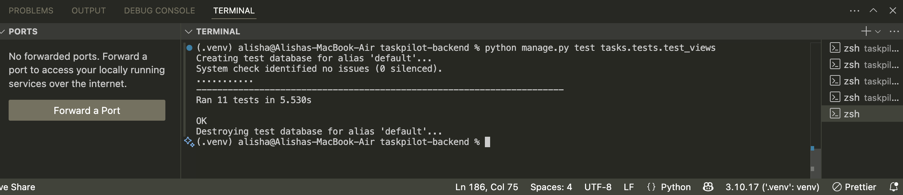
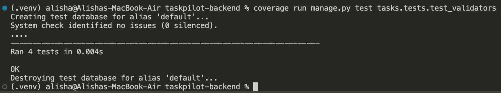
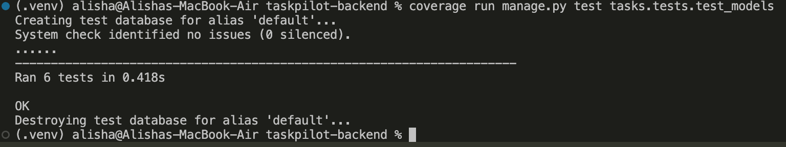


## CSS Validation Testing (Frontend)

To ensure the CSS files in the project adhere to web standards and maintain good quality, I performed automated CSS validation using the `css-validator` npm package.

### Process

- Created a Node.js script (`validate-css.js`) that reads all the main CSS and CSS module files.
- The script sends each CSS file's content to the W3C CSS Validator service via the `css-validator` package.
- Validation results are logged in the console, highlighting errors and warnings for each file.
- Warnings related to vendor-specific properties (like `-webkit-scrollbar`), deprecated properties, and browser-specific extensions were filtered out to focus on actionable errors.
- Fixes were applied for errors found, such as replacing deprecated CSS properties and correcting invalid CSS syntax.
- This validation helps maintain cross-browser compatibility and ensures the CSS codebase remains clean and standard-compliant.

### How to Run

Run the following command in the project root directory:

```bash
node validate-css.js
```

### Outcome

	•	Most CSS files passed validation with no errors.
	•	Known vendor-specific warnings were intentionally ignored as they are necessary for browser compatibility.
	•	Necessary fixes were made to ensure no critical validation errors remain.

Fixed warning

## Fix for Deprecated Media Feature Warning

The original CSS used the deprecated media features `min-device-width` and `max-device-width` to target iPhone 16 and other large notch devices in portrait orientation:

```css
@media screen and (min-device-width: 430px) and (max-device-width: 470px) and (orientation: portrait) {
```

These media features are deprecated and cause warnings during CSS validation.

What I did to fix it:

	•	Removed the padding-top with the calc(env(safe-area-inset-top, 20px) + 4rem) expression due to compatibility issues and instead set a fixed padding:

```css
.welcome-hero {
  padding-top: 4rem;
  align-items: flex-start;
}
```

Before
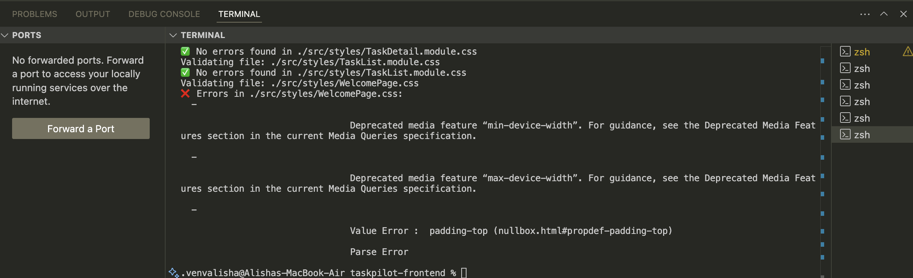

After
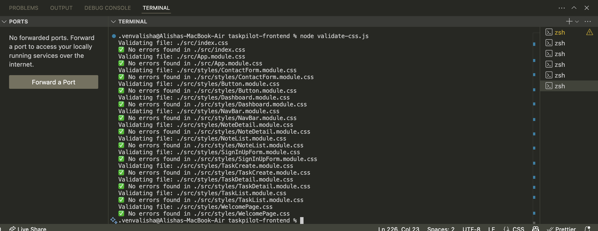

Now all css is passing the tests

### Manual testing

#### Navigation

<details>

<summary>Navigation</summary>

<br>

| ID       | Feature         | Action  | Expected Outcome                                                  | Result | Comment |
|----------|-----------------|---------|-------------------------------------------------------------------|--------|---------|
| NAV-M-01 | Logo            | Click   | Redirect to homepage `/`                                          | Pass   |         |
| NAV-M-02 | Logo            | Focus   | Shows visual focus when tabbed                                    | Pass   |         |
| NAV-M-03 | Toggler Icon    | Display | Visible only on small screens                                     | Pass   |         |
| NAV-M-04 | Toggler Icon    | Click   | Opens dropdown with navigation links                              | Pass   |         |
| NAV-M-05 | Dashboard Link  | Display | Only visible when a user is signed in                             | Pass   |         |
| NAV-M-06 | Dashboard Link  | Click   | Redirects to `/dashboard`                                         | Pass   |         |
| NAV-M-07 | Home Link       | Display | Only visible when no user is signed in                            | Pass   |         |
| NAV-M-08 | Home Link       | Click   | Redirects to homepage `/`                                         | Pass   |         |
| NAV-M-09 | My Tasks Link   | Display | Only visible when a user is signed in                             | Pass   |         |
| NAV-M-10 | My Tasks Link   | Click   | Redirects to `/tasks`                                             | Pass   |         |
| NAV-M-11 | Notes Link      | Display | Only visible when a user is signed in                             | Pass   |         |
| NAV-M-12 | Notes Link      | Click   | Redirects to `/notes`                                             | Pass   |         |
| NAV-M-13 | New Task Link   | Display | Only visible when a user is signed in                             | Pass   | Top-right placement verified |
| NAV-M-14 | New Task Link   | Click   | Redirects to `/tasks/create`                                      | Pass   |         |
| NAV-M-15 | Sign Out Link   | Display | Only visible when a user is signed in                             | Pass   |         |
| NAV-M-16 | Sign Out Link   | Click   | Logs out the user and redirects to `/signin`                      | Pass   |         |
| NAV-M-17 | Sign In Link    | Display | Only visible when no user is signed in                            | Pass   |         |
| NAV-M-18 | Sign In Link    | Click   | Redirects to `/signin`                                            | Pass   |         |
| NAV-M-19 | Sign Up Link    | Display | Only visible when no user is signed in                            | Pass   |         |
| NAV-M-20 | Sign Up Link    | Click   | Redirects to `/signup`                                            | Pass   |         |
| NAV-M-21 | Active Link     | State   | Current route is highlighted using `.Active` class                | Pass   |         |

</details>

<details>

<summary>useClickOutsideToggle Hook (related to Navbar)</summary>

<br>

| ID        | Feature           | Action                     | Expected Outcome                                     | Result | Comment                     |
| --------- | ----------------- | -------------------------- | ---------------------------------------------------- | ------ | --------------------------- |
| UCT-01    | Initial state     | On hook mount              | `expanded` state is initially `false`                | Pass   | Verified initial state       |
| UCT-02    | Toggle expanded   | Call `setExpanded(true)`   | `expanded` state changes to `true`                   | Pass   | State updates correctly      |
| UCT-03    | Click outside     | Click outside `ref` element| `expanded` state resets to `false`                    | Pass   | Click outside collapses UI   |
| UCT-04    | Click inside      | Click inside `ref` element | `expanded` state remains unchanged                    | Pass   | No collapse on internal click|
| UCT-05    | Event listener    | Mount/unmount              | Adds and removes event listener correctly            | Pass   | No memory leaks or duplicates|

</details>

#### Home

<details>
<summary>Home Page</summary>

<br>

| ID       | Feature            | Action  | Expected Outcome                                                                 | Result | Comment |
|----------|--------------------|---------|----------------------------------------------------------------------------------|--------|---------|
| HOME-M-01 | Page Load         | Open    | Loads welcome page without errors                                               | Pass   |         |
| HOME-M-02 | Title Text        | Display | Shows "Welcome to TaskPilot" title prominently                                  | Pass   |         |
| HOME-M-03 | Subtitle Text     | Display | Displays "Chart your course. Navigate your goals." subtitle                     | Pass   |         |
| HOME-M-04 | Icons             | Display | Icons for task, calendar, and checkmark appear correctly                        | Pass   |         |
| HOME-M-05 | Description Text  | Display | Informational paragraph about TaskPilot is visible                              | Pass   |         |
| HOME-M-06 | "Get Started" Btn | Click   | Redirects to `/signup` page                                                     | Pass   |         |
| HOME-M-07 | "Sign In" Button  | Click   | Redirects to `/signin` page                                                     | Pass   |         |
| HOME-M-08 | Buttons           | Focus   | Buttons receive visual focus when tabbed                                        | Pass   |         |
| HOME-M-09 | Responsiveness    | Resize  | Content adjusts and remains readable on mobile and desktop screens              | Pass   | Checked in Chrome DevTools |
| HOME-M-10 | No User Logged In | Visit   | Does not show links like Dashboard or My Tasks unless signed in                 | Pass   | Verified conditionally displayed in NavBar |
| HOME-M-11 | Styling           | Display | Page uses consistent padding, spacing, and theming per CSS module               | Pass   |         |

</details>

#### Dashboard for logged in users

<details>


<summary>Dashboard</summary>

<br>

| ID       | Feature             | Action  | Expected Outcome                                                       | Result | Comment |
|----------|---------------------|---------|------------------------------------------------------------------------|--------|---------|
| DASH-M-01 | Page Load          | Open    | Loads Dashboard without errors                                         | Pass   |         |
| DASH-M-02 | Header Title       | Display | Shows "Dashboard Overview" heading                                    | Pass   |         |
| DASH-M-03 | Subtitle Text      | Display | Displays productivity insights message                                | Pass   |         |
| DASH-M-04 | Task Card          | Display | Shows task icon, label, and dynamic task count                        | Pass   |         |
| DASH-M-05 | Task Card          | Click   | Redirects to `/tasks` page                                            | Pass   |         |
| DASH-M-06 | Note Card          | Display | Shows note icon, label, and dynamic note count                        | Pass   |         |
| DASH-M-07 | Note Card          | Click   | Redirects to `/notes` page                                            | Pass   |         |
| DASH-M-08 | Contact Card       | Display | Shows contact icon, label, and message                                | Pass   |         |
| DASH-M-09 | Contact Card       | Click   | Redirects to `/contact` page                                          | Pass   |         |
| DASH-M-10 | Create Task Button | Click   | Redirects to `/tasks/create` page                                     | Pass   |         |
| DASH-M-11 | Add Note Button    | Click   | Redirects to `/notes/create` page                                     | Pass   |         |
| DASH-M-12 | API Task Count     | Load    | Accurately fetches and displays the number of tasks from the API      | Pass   |         |
| DASH-M-13 | API Note Count     | Load    | Accurately fetches and displays the number of notes from the API      | Pass   |         |
| DASH-M-14 | Responsiveness     | Resize  | Cards and layout adjust properly for mobile and desktop               | Pass   | Verified via Chrome DevTools |
| DASH-M-15 | Accessibility      | Tab     | All cards and buttons are accessible via keyboard tab navigation      | Pass   |         |

</details>

#### Sign in page
<details>

<summary>Sign In Form</summary>

<br>

| ID        | Feature               | Action     | Expected Outcome                                                              | Result | Comment |
|-----------|-----------------------|------------|-------------------------------------------------------------------------------|--------|---------|
| SIGNIN-01 | Page Load             | Open       | Sign In page loads without console errors                                     | Pass   |         |
| SIGNIN-02 | Username Input        | Display    | Username field is visible with correct placeholder                           | Pass   |         |
| SIGNIN-03 | Username Input        | Typing     | Input updates state and accepts valid text                                   | Pass   |         |
| SIGNIN-04 | Password Input        | Display    | Password field is visible with correct placeholder                           | Pass   |         |
| SIGNIN-05 | Password Input        | Typing     | Input updates state and hides typed text                                     | Pass   |         |
| SIGNIN-06 | Sign In Button        | Display    | Button is visible and styled correctly                                       | Pass   |         |
| SIGNIN-07 | Form Submission       | Valid Data | Logs in user, shows success alert, then redirects to `/dashboard`            | Pass   |         |
| SIGNIN-08 | Form Submission       | Invalid    | Shows warning alert with specific error message                              | Pass   | Tested with wrong credentials |
| SIGNIN-09 | Error Messages        | Feedback   | Displays relevant messages (e.g. invalid user or missing fields)             | Pass   |         |
| SIGNIN-10 | Link to Sign Up       | Click      | Redirects to `/signup` page                                                  | Pass   |         |
| SIGNIN-11 | Accessibility         | Tab Order  | Tabbing allows keyboard-only navigation to all form fields and buttons       | Pass   |         |
| SIGNIN-12 | Responsive Layout     | Resize     | Form resizes properly for mobile and hides image on small screens            | Pass   |         |
| SIGNIN-13 | Image Column          | Display    | Image is hidden on small screens and visible on medium and larger devices     | Pass   |         |

</details>

<details>

#### Sign Up Page

<summary>Sign Up Form</summary>

<br>

| ID        | Feature               | Action     | Expected Outcome                                                              | Result | Comment |
|-----------|-----------------------|------------|-------------------------------------------------------------------------------|--------|---------|
| SIGNUP-01 | Page Load             | Open       | Sign Up page loads with no console errors                                    | Pass   |         |
| SIGNUP-02 | Username Input        | Display    | Username field is visible with placeholder "Choose a username"              | Pass   |         |
| SIGNUP-03 | Username Input        | Typing     | Updates state correctly and accepts valid input                              | Pass   |         |
| SIGNUP-04 | Email Input           | Display    | Email field is visible with correct placeholder                              | Pass   |         |
| SIGNUP-05 | Email Input           | Typing     | Updates state correctly and accepts valid email format                       | Pass   |         |
| SIGNUP-06 | Password Input        | Display    | Password field is visible with correct placeholder                           | Pass   |         |
| SIGNUP-07 | Password Input        | Typing     | Input updates state and hides text                                           | Pass   |         |
| SIGNUP-08 | Confirm Password      | Display    | Confirmation field is visible with correct placeholder                       | Pass   |         |
| SIGNUP-09 | Confirm Password      | Typing     | Input updates state and hides text                                           | Pass   |         |
| SIGNUP-10 | Form Submission       | Valid Data | User is registered and redirected to `/signin`                              | Pass   |         |
| SIGNUP-11 | Form Submission       | Invalid    | Shows error messages from backend in warning alerts                          | Pass   | Tested with unmatched passwords |
| SIGNUP-12 | Non-field Errors      | Trigger    | Backend errors (e.g., username exists) display in alert                      | Pass   |         |
| SIGNUP-13 | Link to Sign In       | Click      | Redirects to `/signin` page                                                  | Pass   |         |
| SIGNUP-14 | Accessibility         | Tab Order  | Tabbing navigates through all interactive elements correctly                 | Pass   |         |
| SIGNUP-15 | Responsive Layout     | Resize     | Form adapts to mobile and desktop view, image hidden on mobile               | Pass   |         |
| SIGNUP-16 | Image Display         | Medium+    | Image column appears only on medium and larger screens                       | Pass   |         |

</details>

#### Task (FULL CRUD)

<details>
<summary>Task List</summary>

<br>

| ID       | Feature               | Action       | Expected Outcome                                                                 | Result | Comment |
|----------|-----------------------|--------------|----------------------------------------------------------------------------------|--------|---------|
| TASK-01  | Page Load             | Open         | Loads the task list page with no console errors                                 | Pass   |         |
| TASK-02  | Progress Bar          | Display      | Progress bar reflects percentage of completed tasks                             | Pass   |         |
| TASK-03  | Create Button         | Click        | Redirects to `/tasks/create`                                                    | Pass   |         |
| TASK-04  | Search Input          | Typing       | Filters task list as user types                                                 | Pass   |         |
| TASK-05  | Sort Dropdown         | Click        | Opens dropdown to select sorting method (Due Date / Priority)                   | Pass   |         |
| TASK-06  | Sort Dropdown         | Select       | Tasks are reordered accordingly                                                 | Pass   |         |
| TASK-07  | Category Filter       | Select       | Only tasks from selected category are displayed                                 | Pass   |         |
| TASK-08  | Today Section         | Display      | Tasks due today are grouped under "Today"                                       | Pass   |         |
| TASK-09  | Week Section          | Display      | Tasks due this week are grouped under "This Week"                               | Pass   |         |
| TASK-10  | Later Section         | Display      | Tasks due later are grouped under "Later"                                       | Pass   |         |
| TASK-11  | Completed Section     | Display      | Completed tasks appear in separate section with green icon                      | Pass   |         |
| TASK-12  | Task Card             | Display      | Displays task title, priority, due date, and interactive controls               | Pass   |         |
| TASK-13  | Update State          | Click        | Clicking the checkbox updates the task's state                                  | Pass   |         |
| TASK-14  | Delete Button         | Click        | Clicking trash icon deletes task (after confirmation if applicable)             | Pass   |         |
| TASK-15  | Pagination Controls   | Click        | Navigates between pages of task cards                                           | Pass   |         |
| TASK-16  | Empty State Message   | Condition    | "No tasks due..." appears if no tasks match selected filter/search              | Pass   |         |
| TASK-17  | Responsive Layout     | Resize       | Layout adjusts properly for mobile and desktop screens                          | Pass   |         |
| TASK-18  | Accessibility (Input) | Tab Order    | Inputs and buttons are accessible via keyboard tabbing                          | Pass   |         |

</details>

<details>

<summary>Create Task</summary>

<br>

| ID        | Feature             | Action     | Expected Outcome                                                                 | Result | Comment |
|-----------|---------------------|------------|----------------------------------------------------------------------------------|--------|---------|
| TSKC-01   | Page Load           | Open       | Create Task page loads with no console errors                                   | Pass   |         |
| TSKC-02   | Form Fields         | Display    | Title, Description, Due Date, Priority, Category, Notes fields are visible      | Pass   |         |
| TSKC-03   | Required Fields     | Submit     | Displays alert if title or due date are missing                                 | Pass   | Basic HTML5 validation |
| TSKC-04   | Priority Dropdown   | Select     | Priority field updates based on selection (low, medium, high)                   | Pass   |         |
| TSKC-05   | Category Dropdown   | Select     | Category field updates when changed                                             | Pass   |         |
| TSKC-06   | Date Picker         | Input      | User can select a due date starting from today                                  | Pass   | Uses `min` date logic |
| TSKC-07   | Notes Input         | Type       | Notes field accepts multiline input                                             | Pass   |         |
| TSKC-08   | Form Submission     | Submit     | Form sends POST request and redirects to `/tasks` on success                    | Pass   |         |
| TSKC-09   | Form Submission     | Fail       | If API fails, user sees an alert                                                | Pass   | "Failed to create task" |
| TSKC-10   | Cancel Navigation   | N/A        | Not applicable — handled by browser navigation buttons                          | N/A    |         |
| TSKC-11   | Accessibility       | Keyboard   | All form fields can be accessed via keyboard tabbing                            | Pass   |         |
| TSKC-12   | Responsive Layout   | Resize     | Layout adjusts properly on mobile and desktop                                   | Pass   |         |

</details>

<details>

<summary>Task Detail</summary>

<br>

| ID         | Feature             | Action     | Expected Outcome                                                  | Result | Comment |
|------------|---------------------|------------|-------------------------------------------------------------------|--------|---------|
| TSKD-01    | Page Load           | Open       | Task details load without error for valid task ID                | Pass   |         |
| TSKD-02    | Page Load           | Open       | Displays error message if task not found                         | Pass   | Triggered manually |
| TSKD-03    | Title Display       | View       | Task title appears as form input (read-only)                     | Pass   |         |
| TSKD-04    | Read-only Fields    | View       | All fields are disabled (non-editable)                           | Pass   |         |
| TSKD-05    | Back Button         | Click      | Navigates to `/tasks`                                            | Pass   |         |
| TSKD-06    | Edit Button         | Click      | Redirects to `/tasks/:id/edit`                                   | Pass   |         |
| TSKD-07    | Delete Button       | Click      | Prompts user, deletes task on confirm, and redirects to `/tasks` | Pass   |         |
| TSKD-08    | Delete Button       | Cancel     | Prompts user and cancels deletion                                | Pass   |         |
| TSKD-09    | Notes Section       | View       | Shows “No notes for this task” if none exist                     | Pass   |         |
| TSKD-10    | Notes Section       | View       | Displays list of associated notes with correct content           | Pass   |         |
| TSKD-11    | Responsiveness      | Resize     | Layout adapts for mobile and desktop                             | Pass   |         |
| TSKD-12    | Accessibility       | Keyboard   | Buttons and links can be accessed via tab navigation             | Pass   |         |

</details>

<details>

<summary>Task Edit</summary>

<br>

| ID         | Feature               | Action           | Expected Outcome                                                  | Result | Comment                     |
|------------|-----------------------|------------------|-------------------------------------------------------------------|--------|-----------------------------|
| TSKE-01    | Page Load             | Open             | Task data and notes load correctly                                | Pass   |                             |
| TSKE-02    | Form Fields           | View             | All task fields pre-filled with current values                    | Pass   |                             |
| TSKE-03    | Form Fields           | Edit             | User can update title, description, due date, priority, etc.     | Pass   |                             |
| TSKE-04    | Submit Button         | Click            | Submits updated task and redirects to `/tasks`                   | Pass   |                             |
| TSKE-05    | Add Note Textarea     | View             | Textarea for new notes is visible                                 | Pass   |                             |
| TSKE-06    | Add Note              | Enter text + Click| Adds new note to the list                                         | Pass   |                             |
| TSKE-07    | Note List             | View             | Displays list of current notes                                    | Pass   |                             |
| TSKE-08    | Edit Note             | Click edit       | Opens editable textarea for note                                  | Pass   |                             |
| TSKE-09    | Save Edited Note      | Click save       | Saves changes and updates note in the list                        | Pass   |                             |
| TSKE-10    | Cancel Note Edit      | Click cancel     | Closes edit without saving                                        | Pass   |                             |
| TSKE-11    | Delete Note           | Click delete + Confirm | Deletes note and removes from list                              | Pass   |                             |
| TSKE-12    | Delete Note           | Click delete + Cancel | Cancels deletion, note remains                                   | Pass   |                             |
| TSKE-13    | Error Handling        | API Failure      | Shows alert on failure to fetch, add, save or delete             | Pass   | Manual API failure simulated |
| TSKE-14    | Responsiveness        | Resize           | Layout adapts correctly for different screen sizes               | Pass   |                             |
| TSKE-15    | Accessibility         | Keyboard         | All interactive elements accessible via keyboard navigation      | Pass   |                             |

</details>

<details>
<summary>Task Delete</summary>

| ID         | Feature          | Action                                  | Expected Outcome                                | Result | Comment              |
|------------|------------------|----------------------------------------|------------------------------------------------|--------|----------------------|
| DEL-T-01   | Delete Button    | Click the "Delete" button on a task card or detail page | A confirmation dialog/modal appears asking to confirm deletion | Pass/Fail |                      |
| DEL-T-02   | Confirm Deletion | Click "Delete" on the confirmation modal | The task is deleted from the list/database     | Pass/Fail |                      |
| DEL-T-03   | Cancel Deletion  | Click "Cancel" on the confirmation modal | The modal closes, and the task remains intact  | Pass/Fail |                      |
| DEL-T-04   | Post-Deletion UI | After confirming deletion, user is redirected to the task list page | Task no longer appears in the task list         | Pass/Fail |                      |
| DEL-T-05   | Error Handling   | Simulate network/API failure on delete request (if possible) | An error message appears notifying deletion failed | Pass/Fail |                      |

</details>

---

### How to perform the test:

1. **Navigate to the Task List page**.
2. **Locate a task you want to delete**.
3. **Click the "Delete" button** on the task card or open task details and click delete.
4. **Verify that a confirmation modal/dialog appears** asking if you're sure.
5. **Test Cancel: Click "Cancel"** and check that the modal closes and the task is still there.
6. **Test Confirm: Click "Delete"** and verify that:
   - The modal closes.
   - The task is removed from the list.
   - You are redirected back to the task list page.
7. Optionally, test error handling by simulating an API failure (using developer tools or backend logs) and confirm an error message shows.

##### Task components

<details>
<summary>TaskForm Component</summary>

<br>

| ID         | Feature           | Action            | Expected Outcome                                                   | Result | Comment                        |
|------------|-------------------|-------------------|--------------------------------------------------------------------|--------|------------------------------|
| TF-01      | Title Input       | Display           | Title input field visible and editable (unless read-only)         | Pass   |                              |
| TF-02      | Title Input       | Required          | Form cannot be submitted without a title                          | Pass   |                              |
| TF-03      | Description       | Display           | Description textarea visible and editable (unless read-only)      | Pass   |                              |
| TF-04      | Due Date Input    | Display           | Due date field visible with minimum date set to today             | Pass   |                              |
| TF-05      | Due Date Input    | Required          | Form cannot be submitted without a due date                       | Pass   |                              |
| TF-06      | Priority Dropdown | Display           | Dropdown with Low, Medium, High options                            | Pass   |                              |
| TF-07      | Priority Dropdown | Select Option     | Selecting an option updates form state                            | Pass   |                              |
| TF-08      | State Dropdown    | Display           | Dropdown with Open, In Progress, Done, Overdue options            | Pass   |                              |
| TF-09      | State Dropdown    | Select Option     | Selecting an option updates form state                            | Pass   |                              |
| TF-10      | Category Dropdown | Display           | Dropdown with Work, Personal, Fitness, Finance, Misc options      | Pass   |                              |
| TF-11      | Category Dropdown | Select Option     | Selecting an option updates form state                            | Pass   |                              |
| TF-12      | Submit Button     | Display           | Submit button visible when not read-only                          | Pass   |                              |
| TF-13      | Submit Button     | Click             | Calls form submit handler and disables when read-only            | Pass   |                              |
| TF-14      | Read-Only Mode    | Render            | All inputs disabled or read-only, submit button hidden           | Pass   |                              |
| TF-15      | Accessibility     | Keyboard Navigation| All inputs and buttons accessible via keyboard                    | Pass   |                              |

</details>

<details>

<summary>CompletedTaskCard Component</summary>

<br>

| ID           | Feature          | Action            | Expected Outcome                                                | Result | Comment                |
| ------------ | ---------------- | ----------------- | ---------------------------------------------------------------| ------ | ---------------------- |
| CTC-01       | Card Display     | Render            | Card displays task title with completed icon                    | Pass   |                        |
| CTC-02       | Description      | Render            | Task description is visible                                     | Pass   |                        |
| CTC-03       | Category Display | Render            | Displays task category with folder icon                         | Pass   |                        |
| CTC-04       | Completed Date   | Render            | Shows completion date with calendar icon                        | Pass   |                        |
| CTC-05       | Priority Badge   | Render            | Priority badge color corresponds to task priority              | Pass   |                        |
| CTC-06       | Delete Button    | Display           | Delete button visible                                           | Pass   |                        |
| CTC-07       | Delete Button    | Click             | Clicking delete calls deleteTask function with task id          | Pass   |                        |
| CTC-08       | Accessibility    | Keyboard & Screen Reader | Buttons and icons accessible via keyboard and screen reader  | Pass   |                        |

</details>

<details>

<summary>PaginationControls Component</summary>

<br>

| ID           | Feature             | Action                  | Expected Outcome                                                      | Result | Comment                |
| ------------ | ------------------- | ----------------------- | -------------------------------------------------------------------- | ------ | ---------------------- |
| PGC-01       | Render Buttons      | Render                  | Renders one button per page based on total and tasksPerPage          | Pass   |                        |
| PGC-02       | Highlight Current   | Visual                  | Current page button has 'primary' variant; others 'outline-primary'  | Pass   |                        |
| PGC-03       | Button Click        | Click                   | Clicking a page button calls setCurrentPage with correct page number | Pass   |                        |
| PGC-04       | Conditional Render  | Render                  | Does not render if totalPages ≤ 1                                    | Pass   |                        |
| PGC-05       | Accessibility       | Keyboard & Screen Reader| Buttons are focusable and accessible                                  | Pass   |                        |

</details>

<details>

<summary>TaskCard Component</summary>

<br>

| ID        | Feature          | Action                 | Expected Outcome                                                      | Result | Comment                 |
| --------- | ---------------- | ---------------------- | -------------------------------------------------------------------- | ------ | ----------------------- |
| TSKC-01   | State Selector   | Display                | Shows dropdown with states: Open, In Progress, Done                  | Pass   |                         |
| TSKC-02   | State Selector   | Change                 | Changing state calls updateState with correct params                | Pass   |                         |
| TSKC-03   | Title Link       | Click                  | Navigates to `/tasks/{task.id}` detail page                          | Pass   |                         |
| TSKC-04   | Description      | Display                | Shows task description text                                          | Pass   |                         |
| TSKC-05   | Category Display | Display                | Shows task category with icon                                        | Pass   |                         |
| TSKC-06   | Due Date Display | Display                | Shows task due date with calendar icon                               | Pass   |                         |
| TSKC-07   | Priority Badge   | Display                | Shows colored badge according to priority                            | Pass   | Colors: red/yellow/green|
| TSKC-08   | Edit Button      | Click                  | Navigates to `/tasks/{task.id}/edit`                                | Pass   |                         |
| TSKC-09   | Delete Button    | Click                  | Calls deleteTask with task id                                        | Pass   |                         |
| TSKC-10   | Styling          | Visual                 | Card has border color based on priority and style changes if done   | Pass   |                         |

</details>

<details>

<summary>TaskCategoryFilter Component</summary>

<br>

| ID          | Feature          | Action                 | Expected Outcome                                                     | Result | Comment                      |
| ----------- | ---------------- | ---------------------- | ------------------------------------------------------------------- | ------ | ---------------------------- |
| TCF-01      | Category Buttons | Display                | Renders a button for each category                                  | Pass   |                              |
| TCF-02      | Category Buttons | Click                  | Clicking a button sets it as the selected category                  | Pass   |                              |
| TCF-03      | Selected Button  | Visual Highlight       | Selected category button is styled with "primary" variant          | Pass   | Others styled "outline-primary" |
| TCF-04      | Button Text      | Display                | Category names capitalized with tag icon displayed                  | Pass   |                              |
| TCF-05      | Button Layout    | Visual                 | Buttons wrap and are centered responsively                         | Pass   |                              |

</details>

<details>

<summary>DeleteConfirmModal Component</summary>

<br>

| ID          | Feature        | Action                | Expected Outcome                                              | Result | Comment                     |
| ----------- | -------------- | --------------------- | ------------------------------------------------------------- | ------ | --------------------------- |
| DCM-01      | Modal Display  | Show                  | Modal appears centered with title "Confirm Delete"            | Pass   |                             |
| DCM-02      | Modal Content  | Display               | Confirmation message shown: "Are you sure you want to delete this item?" | Pass   |                             |
| DCM-03      | Error Message  | Display on error prop  | Error text shown in red if `error` prop is passed              | Pass   |                             |
| DCM-04      | Cancel Button  | Click                 | Calls `onHide` callback and closes the modal                   | Pass   |                             |
| DCM-05      | Delete Button  | Click                 | Calls `onConfirm` callback to confirm deletion                 | Pass   |                             |
| DCM-06      | Close Button   | Click                 | Modal closes when close button in header is clicked           | Pass   |                             |

</details>

##### Task hook

<details>
<summary>useTaskForm Hook</summary>

<br>

| ID        | Feature            | Action                | Expected Outcome                                 | Result | Comment                    |
| --------- | ------------------ | --------------------- | ------------------------------------------------ | ------ | -------------------------- |
| UTF-01    | Initial State      | On mount              | `formData` initialized with default values      | Pass   |                            |
| UTF-02    | handleChange       | Change input field    | Updates corresponding field in `formData`       | Pass   | Tested with text inputs     |
| UTF-03    | handleSelect       | Select dropdown option | Updates dropdown field in `formData`             | Pass   | Tested priority, state etc. |
| UTF-04    | handleSubmit       | Submit form           | Sends PUT request to `/api/tasks/{taskId}/` with updated data | Pass   | Successfully updates task   |
| UTF-05    | handleSubmit       | Error during submit   | Alerts "Failed to update task"                   | Pass   | Handles API failure         |
| UTF-06    | getMinDate         | Call                  | Returns today's date in `YYYY-MM-DD` format     | Pass   |                            |

</details>

<details>

<summary>useTasks Hook</summary>

<br>

| ID        | Feature             | Action                   | Expected Outcome                                         | Result | Comment                     |
| --------- | ------------------- | ------------------------ | -------------------------------------------------------- | ------ | --------------------------- |
| UTK-01    | Fetch tasks         | On mount                 | Fetches tasks from API and sets `tasks` state            | Pass   | Tested on component load     |
| UTK-02    | Fetch categories    | On mount                 | Extracts unique categories plus "all" and sets `categories` | Pass   | Categories include "all"     |
| UTK-03    | deleteTask          | Confirm and delete task  | Removes task from API and updates local `tasks` state    | Pass   | Confirmation prompt appears  |
| UTK-04    | updateTaskState     | Change task state        | Sends PUT request updating state, updates local `tasks`  | Pass   | State updates reflected      |
| UTK-05    | filterAndSortTasks  | Filter by category/search| Returns filtered and sorted tasks based on parameters    | Pass   | Filters and sorts correctly  |
| UTK-06    | groupTasks          | Group by due dates       | Groups tasks into today, this week, and later            | Pass   | Groups match expected dates  |
| UTK-07    | Error handling      | On API errors            | Logs errors to console for fetch, delete, and update     | Pass   | Errors logged appropriately  |

</details>

#### Note pages (FULL CRUD)

<details>
<summary>NoteList</summary>

<br>

| ID        | Feature           | Action                        | Expected Outcome                                              | Result | Comment                        |
| --------- | ----------------- | -----------------------------| --------------------------------------------------------------| ------ | ------------------------------|
| NL-01     | Loading State     | Component mounts and fetches notes | Spinner and loading text displayed                            | Pass   |                                |
| NL-02     | Error Handling    | Simulate fetch error           | Error alert with message shown                                | Pass   |                                |
| NL-03     | Empty Notes List  | Notes array empty              | Message "No notes found. Start by adding one!" displayed      | Pass   |                                |
| NL-04     | Notes Display     | Notes array has items          | Notes rendered as grid of NoteCard components                 | Pass   |                                |
| NL-05     | Add Note Button   | Click on Add Note              | Navigates to `/notes/create` page                             | Pass   |                                |
| NL-06     | Header Title      | Page loads                    | Header shows "Notes" with icon                                | Pass   |                                |

</details>

<details>

<summary>NoteEdit</summary>

<br>

| ID        | Feature            | Action                           | Expected Outcome                                      | Result | Comment                        |
| --------- | ------------------ | --------------------------------| -----------------------------------------------------| ------ | ------------------------------|
| NE-01     | Page Load          | Navigate to edit note URL        | Page loads with existing note data filled in form    | Pass   |                               |
| NE-02     | Error Display      | Simulate fetch error             | Error alert with message shown                        | Pass   |                               |
| NE-03     | Success Message    | Submit valid update              | Success alert shown, redirects to related task       | Pass   |                               |
| NE-04     | Form Inputs        | Edit task selection and body    | Inputs update with user changes                       | Pass   |                               |
| NE-05     | Form Submission    | Submit form                     | Calls update API and handles response correctly      | Pass   |                               |
| NE-06     | API Error Handling | API update fails                 | Error alert shown with appropriate message           | Pass   |                               |
| NE-07     | Redirect           | After successful update          | Redirects to `/tasks/{taskId}` after brief delay     | Pass   |                               |

</details>

<details>

<summary>NoteDetail</summary>

<br>

| ID        | Feature          | Action                            | Expected Outcome                                      | Result | Comment                        |
| --------- | ---------------- | -------------------------------- | -----------------------------------------------------| ------ | ------------------------------|
| ND-01     | Loading State    | Navigate to note detail URL       | Shows loading spinner and message                     | Pass   |                               |
| ND-02     | Fetch Success    | Load existing note                | Note details displayed correctly                      | Pass   |                               |
| ND-03     | Fetch Error      | Simulate API error                | Error message displayed                               | Pass   |                               |
| ND-04     | Note Not Found   | Access non-existent note          | "Note not found" message displayed                     | Pass   |                               |
| ND-05     | Task Link       |
</details>

<details>

<summary>NoteCreate</summary>

<br>

| ID         | Feature           | Action                        | Expected Outcome                                   | Result | Comment                      |
| ---------- | ----------------- | -----------------------------| ------------------------------------------------- | ------ | ---------------------------- |
| NC-CRE-01  | Load Form         | Navigate to add note page     | NoteForm loads with task options                   | Pass   |                              |
| NC-CRE-02  | Form Validation   | Submit empty form             | Shows validation error "Both fields are required" | Pass   |                              |
| NC-CRE-03  | Submit Note       | Fill form and submit          | Note created, success message shown, redirects to task detail page | Pass   |                              |
| NC-CRE-04  | Submit Failure    | Simulate API failure on submit | Shows error "Failed to create note. Please try again." | Pass   |                              |
| NC-CRE-05  | Success Message   | Submit note successfully      | Displays success message briefly                    | Pass   |                              |

</details>

<details>

<summary>NoteDelete</summary>

<br>

| ID        | Feature           | Action                          | Expected Outcome                                        | Result | Comment                     |
| --------- | ----------------- | -------------------------------| -------------------------------------------------------| ------ | ---------------------------|
| ND-DEL-01| Load Note         | Navigate to delete note URL     | Note data fetched, task ID retrieved                    | Pass   |                             |
| ND-DEL-02| Fetch Error       | Simulate API failure on load    | Error message "Failed to load note." shown              | Pass   |                             |
| ND-DEL-03| Delete Note       | Click "Delete" button           | Note deleted, redirects to related task page or notes list | Pass   |                             |
| ND-DEL-04| Delete Error      | Simulate API failure on delete  | Error message "Failed to delete note." shown            | Pass   |                             |
| ND-DEL-05| Cancel Button     | Click "Cancel" button           | Navigates back to previous page                          | Pass   |                             |

</details>

<details>

<summary>NoteForm</summary>

<br>

| ID        | Feature            | Action                         | Expected Outcome                                      | Result | Comment                       |
| --------- | ------------------ | ------------------------------| -----------------------------------------------------| ------ | -----------------------------|
| NF-01     | Initial Values     | Render with initial props      | Inputs pre-filled with `initialBody` and `initialTask` | Pass   |                               |
| NF-02     | Task Dropdown      | Open dropdown                 | Shows list of tasks passed via `tasks` prop           | Pass   |                               |
| NF-03     | Task Selection     | Select a task from dropdown   | `selectedTask` state updates accordingly              | Pass   |                               |
| NF-04     | Note Body Input    | Type into textarea            | `body` state updates accordingly                       | Pass   |                               |
| NF-05     | Validation         | Submit without task or body   | Error message "Both fields are required." displayed   | Pass   |                               |
| NF-06     | Submit Button      | Click submit with valid input | Calls `onSubmit` prop function with correct data      | Pass   |                               |
| NF-07     | Error Display      | Validation fails              | Error message appears, form submission prevented      | Pass   |                               |

</details>

##### Note custom hooks

<details>

<summary>useNoteForm (custom hook)</summary>

<br>

| ID         | Feature              | Action                          | Expected Outcome                                  | Result | Comment                             |
|------------|----------------------|---------------------------------|--------------------------------------------------|--------|-----------------------------------|
| NH-01      | Load Tasks           | Mount component using hook       | Tasks fetched from API and stored in state       | Pass   |                                   |
| NH-02      | Default Task Select  | Mount with no noteId             | First task in list auto-selected                  | Pass   |                                   |
| NH-03      | Load Note Data       | Mount with noteId                | Note body and task selected set from API         | Pass   |                                   |
| NH-04      | Handle Fetch Errors  | Simulate API failure             | Errors state set appropriately                     | Pass   |                                   |
| NH-05      | Clear Success Message| Success message set              | Success message clears automatically after 2s    | Pass   |                                   |

</details>

<details>

<summary>useNotesList (custom hook)</summary>

<br>

| ID         | Feature            | Action                    | Expected Outcome                                  | Result | Comment                             |
|------------|--------------------|---------------------------|--------------------------------------------------|--------|-----------------------------------|
| NL-01      | Fetch Notes        | Mount component using hook | Notes fetched from API and stored in state       | Pass   |                                   |
| NL-02      | Loading State      | While fetching             | Loading state is true                             | Pass   |                                   |
| NL-03      | Error Handling     | Simulate API failure       | Error message set and loading is false           | Pass   |                                   |
| NL-04      | Cleanup            | Unmount component          | Prevent state update on unmounted component      | Pass   | Avoids React warnings              |

</details>

##### Note components

<details>
<summary>NoteCard</summary>

<br>

| ID        | Feature           | Action                          | Expected Outcome                                                  | Result | Comment                       |
|-----------|-------------------|---------------------------------|------------------------------------------------------------------|--------|------------------------------|
| NC-01     | Card Rendering    | Render component with note prop | Displays a card container with proper styling                    | Pass   |                              |
| NC-02     | Title Display     | Note body longer than 80 chars  | Displays truncated body text with ellipsis                       | Pass   |                              |
| NC-03     | Title Display     | Note body shorter than 80 chars | Displays full note body                                           | Pass   |                              |
| NC-04     | Note Link         | Click on note body link          | Navigates to `/notes/{note.id}`                                  | Pass   |                              |
| NC-05     | Task Link         | Click on associated task link   | Navigates to `/tasks/{note.task.id}`                             | Pass   |                              |
| NC-06     | Accessibility     | Card has role="article" and tabIndex="0" | Card is focusable and correctly identified by screen readers    | Pass   |                              |
| NC-07     | Timestamp Display | Displays date_added in locale    | Shows human-readable timestamp with icon                        | Pass   |                              |

</details>

<details>

<summary>NoteCardForTask</summary>

<br>

| ID          | Feature           | Action                  | Expected Outcome                                          | Result | Comment                       |
|-------------|-------------------|-------------------------|----------------------------------------------------------|--------|------------------------------|
| NCFT-01     | Card Rendering    | Render component         | Displays a card container with proper styling             | Pass   |                              |
| NCFT-02     | Note Body Display | Render with note prop    | Displays the full note body text                           | Pass   |                              |
| NCFT-03     | Timestamp Display | Shows date_added/created_at | Shows human-readable timestamp with icon                | Pass   | Falls back to created_at if date_added missing |
| NCFT-04     | Accessibility     | Card container present   | Card is rendered semantically and visually clear          | Pass   |                              |

</details>


#### Path URL:s & Authentication

<details>

<summary>PrivateRoute</summary>

<br>

| ID         | Feature            | Action                    | Expected Outcome                                    | Result | Comment                    |
|------------|--------------------|---------------------------|----------------------------------------------------|--------|---------------------------|
| PR-01      | Route Protection    | Navigate to protected route when logged in  | Allows access to the requested component             | Pass   |                           |
| PR-02      | Route Protection    | Navigate to protected route when not logged in | Redirects user to `/signin` page                      | Pass   |                           |
| PR-03      | Props forwarding    | Passes all route props to component          | Component receives route props correctly              | Pass   |                           |

</details>

<details>

<summary>App Routing</summary>

<br>

| ID     | Feature           | Action                        | Expected Outcome                                          | Result | Comment                            |
|--------|-------------------|-------------------------------|----------------------------------------------------------|--------|----------------------------------|
| APP-01 | Public Routes     | Visit `/`, `/signin`, `/signup` | Pages load without authentication                         | Pass   |                                  |
| APP-02 | Private Routes    | Visit protected routes logged in | Access granted and page content rendered                  | Pass   | Tested with authenticated user    |
| APP-03 | Private Routes    | Visit protected routes not logged in | Redirects to `/signin` page                                | Pass   |                                  |
| APP-04 | Fallback Route    | Visit undefined route          | Displays "Page not found!" message                        | Pass   |                                  |
| APP-05 | NavBar Display   | NavBar shows on all pages except `/` | NavBar visible on all except WelcomePage at `/`          | Pass   |                                  |
| APP-06 | Scroll Lock      | Visit `/` page                 | Body has `no-scroll` class applied                         | Pass   |                                  |

</details>

<details>

<summary>CurrentUserContext</summary>

<br>

| ID       | Feature                        | Action                                            | Expected Outcome                                                                                   | Result | Comment                          |
| -------- | ------------------------------| -------------------------------------------------| ------------------------------------------------------------------------------------------------- | ------ | ------------------------------- |
| CUC-01   | Fetch Current User on Load     | Load app                                         | Fetches current user data; sets currentUser or null                                               | Pass   | Tested with logged in and logged out states |
| CUC-02   | userLoaded state               | Load app                                         | `userLoaded` state becomes true after user fetch attempt                                          | Pass   |                                  |
| CUC-03   | Axios Request Interceptor      | Make any API request                             | Request interceptor passes config without modification                                            | Pass   |                                  |
| CUC-04   | Axios Response Interceptor     | API returns 401 when user not on `/signin`      | Clears currentUser state and redirects to `/signin`                                              | Pass   |                                  |
| CUC-05   | Axios Response Interceptor     | API returns 401 when user already on `/signin`  | Does not redirect                                                                                 | Pass   | Prevents redirect loop            |
| CUC-06   | Context Providers              | Wrap children components                         | Provides currentUser, setCurrentUser, and userLoaded contexts correctly                            | Pass   |                                  |

</details>

<details>

<summary>CurrentUserContext Hooks</summary>

<br>

| ID        | Hook             | Action                                     | Expected Outcome                                                   | Result | Comment                         |
| --------- | ---------------- | -----------------------------------------| ----------------------------------------------------------------- | ------ | ------------------------------ |
| CUCH-01   | useCurrentUser   | Call hook inside a component              | Returns current user object or null                               | Pass   | Verified with logged-in & logged-out users |
| CUCH-02   | useSetCurrentUser| Call hook inside a component              | Returns function to update currentUser state                      | Pass   | Verified setCurrentUser updates context correctly |
| CUCH-03   | useUserLoaded    | Call hook before and after user loads     | Returns false initially, then true after user info fetched       | Pass   | Ensures components wait for user loading |
| CUCH-04   | useCurrentUser   | When currentUser is null                   | Components behave as unauthenticated user (e.g., redirect to signin) | Pass | Confirmed protected routes redirect |
| CUCH-05   | useSetCurrentUser| Update currentUser state                   | Application UI updates accordingly (e.g., NavBar shows correct links) | Pass | Verified UI updates on login/logout |
| CUCH-06   | All hooks        | Used outside Provider                      | Throws error or returns undefined (React behavior)               | Pass   | Ensure hooks used only inside provider |

</details>

## Bugs Encountered & Solutions

### Bug: Favicon and Static File Path Errors on Deployment

_<span style="color: blue;">[Back to Content](#table-of-contents)</span>_

## Problem

After deployment, the application displayed **404 Not Found** errors for the following favicon-related files:

- `/favicon_io/logo.png`
- `/favicon_io/site.webmanifest`

Additionally, there were issues with Django not properly collecting or serving some static files from the React build.

## Cause

- The favicon files were located in `staticfiles/favicon_io/`, but the React app expected them at `/static/favicon_io/`.
- `collectstatic` was not moving or recognizing some assets because of incorrect folder structure or `STATICFILES_DIRS` misconfiguration.

## Solution

1. **Moved Favicon Files**  
   Moved the favicon assets into the React build path:  
   `staticfiles/build/favicon_io/`

2. **Updated Django Settings**  
   In `settings.py`, configured static settings to serve React and Django assets correctly.


3. **Committed React Build**  
   The built React files inside `staticfiles/build/` were committed to Git to ensure they are available on Heroku during deployment.

4. **Collected Static Files**  
   Ran:

```bash
   python manage.py collectstatic --noinput
```

```bash
STATIC_URL = '/static/'

STATICFILES_DIRS = [
    BASE_DIR / 'staticfiles' / 'build' / 'static',  # React static files
]

This gathered Django admin static files and merged them with the React build in the staticfiles directory.

STATIC_ROOT = BASE_DIR / 'staticfiles'
WHITENOISE_ROOT = BASE_DIR / 'staticfiles' / 'build'

STATICFILES_STORAGE = 'whitenoise.storage.CompressedManifestStaticFilesStorage'
```

---

### Bug: 401 Unauthorized When Fetching User Info After Login

**Context**  
I’m connecting my React frontend to a Django REST API using `dj-rest-auth` for authentication. The goal was to:  
- Log in users via `/dj-rest-auth/login/`  
- Store auth tokens in cookies  
- Automatically send those cookies with subsequent requests  
- Persist login state by fetching user info from `/dj-rest-auth/user/`

**The Problem**  
Login succeeded and the authentication cookies (`my-app-auth` and `my-refresh-token`) were correctly set, but a request to `/dj-rest-auth/user/` always returned a **401 Unauthorized** error.  
Cookies were present, CORS and CSRF were configured correctly, yet the cookies were not sent with the request.

**Solution**  
Updated Django REST Framework settings to disable the Browsable API and always respond with JSON:
```python
REST_FRAMEWORK = {
    'DEFAULT_RENDERER_CLASSES': [
        'rest_framework.renderers.JSONRenderer',
    ],
    ...
}

After this change, the /dj-rest-auth/user/ endpoint correctly responded with JSON, the cookies 
Special thanks to Roman, my tutor, for helping me debug and resolve the authentication issue with dj-rest-auth and cookie-based login.
```

###  BUG: useNavigate Not Found

**Problem:** 
Attempted to use useNavigate from react-router-dom, but the app threw the following error:
> Attempted import error: 'useNavigate' is not exported from 'react-router-dom'

**Cause:**  
The project was using an older version of react-router-dom (v5), where useNavigate is not available.

**Solution:**

Replaced useNavigate with useHistory, which is the correct hook for programmatic navigation in react-router-dom@5. The redirection after creating a task was handled using:

```js
import { useHistory } from 'react-router-dom';

const history = useHistory();
history.push("/tasks");
```

###  BUG: 404 Error on POST to /api/tasks/

**Problem:** 
Submitting the task creation form led to:

"POST http://localhost:3000/api/tasks/ 404 (Not Found)"

**Cause:**  
The frontend was pointing to localhost:3000, but the backend was deployed on Heroku with a different domain.

**Solution:**
Set up a global Axios base URL in axiosDefaults.js:

"axios.defaults.baseURL = 'https://taskpilot-backend-6ee557f05c5b.herokuapp.com/';"

This ensured all API requests were routed to the correct backend.

###  BUG: Invalid JSON Response (Unexpected Token <)

**Problem:** 
After the failed POST request, another error appeared:

"SyntaxError: Unexpected token '<', "<!DOCTYPE " is not valid JSON"

**Cause:**  
The frontend was expecting JSON but received an HTML error page (due to 404), which is common when the backend URL is incorrect.

**Solution:**
This error was resolved along with the 404 issue by fixing the axios.defaults.baseURL to point to the correct backend.

After fixing these bugs, the TaskCreate component successfully:
	•	Created a new task by posting to the correct API.
	•	Redirected to the task list page (/tasks) upon successful creation.
	•	Rendered the newly created task immediately in the list.


###  BUG: Notes Related to Tasks

Fix: Handling Notes Related to Tasks in Serializer

When fetching or creating notes related to a task, the serializer initially assumed the presence of a valid request object in the context. This caused errors if the request was missing or improperly passed, especially when serializing tasks outside the usual request flow (e.g., in tests or admin views).

How it was fixed:
	•	Added safe checks in the TaskSerializer to verify the request exists in the serializer context before accessing request.user.
	•	In the NoteSerializer, dynamically adjusted the queryset for the task field based on the authenticated user in the request, ensuring notes can only be created for tasks owned by that user.
	•	This prevents unauthorized or erroneous note creation and fixes bugs related to missing or invalid request contexts during serialization.

This ensures consistent, secure handling of notes linked to tasks and improves robustness across different usage scenarios.


###  BUG: Attachment Field and Cloudinary Integration

 Bug Fix: Removing Attachment Field and Cloudinary Integration

 Background

During development, the attachment field was implemented using CloudinaryField for image/file uploads. However, it later became clear that this feature no longer suited the direction of the project. Removing it required careful handling of model migrations and dependencies to avoid breaking the app — especially since the project had already been deployed.

Final Clean-Up Checklist

To fully remove the attachment feature and Cloudinary integration, the following steps were followed:
	•	attachment field removed from models.py
	•	Migration created and applied using:

python manage.py makemigrations
python manage.py migrate

	•	Cloudinary uninstalled:

pip uninstall cloudinary

	•	cloudinary and related apps removed from INSTALLED_APPS in settings.py
	•	All references to CloudinaryField and from cloudinary.models import CloudinaryField removed
	•	validators.py still present — pending removal due to a reference error (under investigation)

#### Important Note on Migrations

At one point, a workaround required re-adding the attachment field temporarily to avoid migration conflicts. Once the blockers were resolved, the correct step was:
	•	Delete the field again from models.py
	•	Run a new migration:

This generated a final migration (e.g., 0006_remove_task_attachment) that properly aligns the current database schema with the updated models.

#### Remaining Issue
	•	validators.py cannot be deleted yet, as it still causes an error when removed. This file will be reviewed and cleaned up in a future update. Same goes for uninstalling cloudinary. 


###  Bug: Task Update API - 400 Bad Request on due_date

Issue

When updating a task via the API, the backend returned a 400 Bad Request error specifically related to the due_date field. The API response indicated a validation error with the due_date, even though the date appeared to be correctly formatted in the frontend payload.

Root Cause

The backend model expected due_date to be a DateTimeField, requiring a full ISO 8601 datetime string (including both date and time components). Initially, the frontend was sending only a date string (e.g., "2025-06-01"), which was insufficient for the model validation.

Solution

The frontend was updated to send a properly formatted ISO 8601 datetime string with time included (e.g., "2025-06-01T00:00:00" or an equivalent UTC time). This ensured that the due_date field matched the backend expectations.

Example of the fixed payload:

{
  "title": "Cook pasta",
  "description": "Find a recipe",
  "priority": "medium",
  "state": "open",
  "category": "misc",
  "due_date": "2025-06-01T00:00:00"
}

Key Takeaways
	•	Always ensure date/time fields match the backend model’s required format.
	•	Use ISO 8601 datetime strings for DateTimeField in Django REST Framework.
	•	Check backend serializer error messages carefully — they often pinpoint the exact field causing the validation issue.


### Bug: Note Task Title Not Displaying in API Response

**Description:**  
When fetching notes, the associated task’s details (such as the task title) were not included in the API response. Instead, only the task ID was returned. This caused frontend components to show placeholders like “No associated task” or “Unknown Task” because they lacked the full task information.

**Root Cause:**  
The `NoteSerializer` used a `PrimaryKeyRelatedField` for the `task` field with an empty queryset by default. This field only returned the task’s ID, and did not serialize the full task object including the title or other useful fields.

**Fix:**  
We replaced the `PrimaryKeyRelatedField` with a nested `TaskSerializer` in the `NoteSerializer`, setting the `task` field to `TaskSerializer(read_only=True)`. This change ensures that when notes are serialized, the complete task details (including the title) are embedded in the API response. This fix allows the frontend to correctly display the task name connected to each note.

---

## Function Test

<details>
<summary>Test configuration</summary>

<br>

_<span style="color: blue;">[Back to Content](#table-of-contents)</span>_

**Test Environment**

- **Desktop**:
  - MacBook Pro M1, 2020
- **Screen**:
  - Built-in Retina Display / 2560 x 1600
- **Mobile**:
  - iPhone 12
  - iPhone 16 Pro

**Browser Compatibility**

The site was tested on the following browsers:

- Google Chrome – Version 125.0.6422.60
- Safari – Version 17.4
- Mozilla Firefox – Version 126.0
- Brave Browser - Version 1.79.118

</details>
