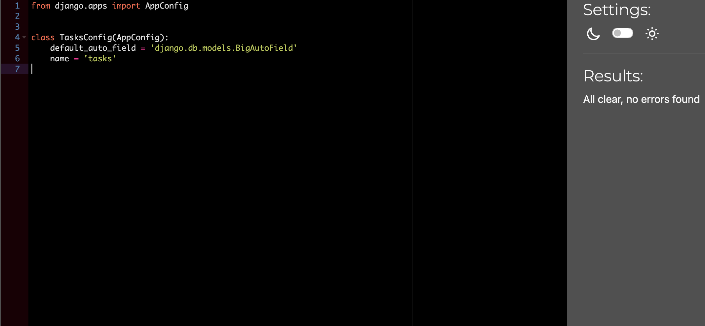

## Testing

# Table of Contents

- [Manual Testing](#manual-testing)
  - [User Stories and Epics](#user-stories-and-epics)
- [Validator Testing](#validator-testing)
  - [JSX](#jsx)
  - [HTML](#html)
  - [CSS](#css)
- [Automated Testing](#automated-testing)
  - [Backend API Automated Testing](#backend-api-automated-testing)
- [CSS Validation Testing](#css-validation-testing)
  - [Process](#process)
  - [How to Run](#how-to-run)
  - [Outcome](#outcome)
- [Fix for Deprecated Media Feature Warning](#fix-for-deprecated-media-feature-warning)
- [Bug: Favicon and Static File Path Errors on Deployment](#bug-favicon-and-static-file-path-errors-on-deployment)
  - [Problem](#problem)
  - [Cause](#cause)
  - [Solution](#solution)

### Manual testing

<details>
<summary> User Stories and Epics</summary>  
<br>

---

### **EPIC – Task Management**

| Goals | How are they achieved? | Comment |
| --- | --- | --- |
| As an authenticated user, I want to create a new task so I can manage my responsibilities | API endpoint `/api/tasks/` with POST method, using TaskSerializer | |
| As an authenticated user, I want to view a list of my tasks | API endpoint `/api/tasks/` with GET method filtered by user | |
| As an authenticated user, I want to view task details including attached notes | Detail view at `/api/tasks/<id>/` returns nested notes via TaskWithNotesSerializer | |
| As an authenticated user, I want to update a task | API endpoint `/api/tasks/<id>/` with PUT method, protected by IsOwnerOnly permission | |
| As an authenticated user, I want to delete a task I no longer need | DELETE request to `/api/tasks/<id>/` | |
| As an authenticated user, I want tasks to automatically be marked as overdue | Overridden `save()` method on Task model checks due date | |

---

### **EPIC – Notes System**

| Goals | How are they achieved? | Comment |
| --- | --- | --- |
| As an authenticated user, I want to create a note attached to a task | API POST to `/api/notes/`, task is required and must belong to the user | |
| As an authenticated user, I want to view all my notes | GET request to `/api/notes/` only returns notes by the current user | |
| As an authenticated user, I want to edit a note | PUT/PATCH request to `/api/notes/<id>/` | |
| As an authenticated user, I want to delete a note I no longer need | DELETE request to `/api/notes/<id>/` | |

---

### **EPIC – Authentication & Session Management**

| Goals | How are they achieved? | Comment |
| --- | --- | --- |
| As a new user, I want to register for an account | Endpoint `/api/dj-rest-auth/registration/` using dj-rest-auth | |
| As a returning user, I want to log in and receive a JWT | Endpoint `/api/dj-rest-auth/login/`, returns access and refresh tokens | |
| As a logged-in user, I want to log out securely | Endpoint `/api/dj-rest-auth/logout/`, using `logout_route` view | |
| As a user, I want to refresh my JWT to stay logged in | Endpoint `/api/token/refresh/` | |

---

### **EPIC – Contact & Feedback**

| Goals | How are they achieved? | Comment |
| --- | --- | --- |
| As a user, I want to submit a message for support | POST request to `/api/contact/` | |
| As an admin, I want to view all submitted messages | GET request to `/api/contact/messages/`, protected with `IsAdminUser` | |

---

### **EPIC – Permissions and Security**

| Goals | How are they achieved? | Comment |
| --- | --- | --- |
| As an authenticated user, I want to only access my own data | All task/note queries filter by request.user; permissions enforced | |
| As an unauthorized user, I should be blocked from others’ content | Custom permission class `IsOwnerOnly` applied to detail views | |
| As an admin, I want to access all contact messages | Contact list view uses `IsAdminUser` permission | |

</details>

_<span style="color: blue;">[Back to Content](#table-of-contents)</span>_


## Validator Testing

### JSX

Throughout the development process, I have consistently used **Prettier** and **ESLint** to ensure that the JSX and JavaScript code meets high standards of readability, consistency, and correctness.

- **Prettier** automatically formats the code, enforcing a uniform style such as indentation, line length, quotes, and spacing. This reduces style debates and keeps the codebase clean.
- **ESLint** statically analyzes the code to catch potential errors, enforce best practices, and maintain coding conventions. It helps detect issues like unused variables, incorrect prop types, and potential runtime errors.
- The project is configured to run these tools automatically during development, including integration with editors and pre-commit hooks, making it easy to maintain code quality continuously.
- Using Prettier and ESLint together helps improve developer productivity by providing immediate feedback and ensuring that code adheres to the agreed-upon standards.
- The setup also includes React-specific linting rules to cover common pitfalls and patterns in React development.
- This approach contributes to a maintainable, scalable, and bug-minimized frontend codebase.

### HTML

I validated my HTML pages using the W3 Nu HTML Checker. They came back with no errors, only pointers about redundant trailing slashes left by React. Please check the results for each page below.

<details>
<summary>HTML validation results</summary>

[Homepage](https://validator.w3.org/nu/?doc=https%3A%2F%2Ftaskpilot-backend-6ee557f05c5b.herokuapp.com%2F)
[Sign in Page](https://validator.w3.org/nu/?doc=https%3A%2F%2Ftaskpilot-backend-6ee557f05c5b.herokuapp.com%2Fsignin)
[Sign up Page](https://validator.w3.org/nu/?doc=https%3A%2F%2Ftaskpilot-backend-6ee557f05c5b.herokuapp.com%2Fsignup)
[Dashboard](https://validator.w3.org/nu/?doc=https%3A%2F%2Ftaskpilot-backend-6ee557f05c5b.herokuapp.com%2Fdashboard)
[Task list page](https://validator.w3.org/nu/?doc=https%3A%2F%2Ftaskpilot-backend-6ee557f05c5b.herokuapp.com%2Ftasks)
[Create task page](https://validator.w3.org/nu/?doc=https%3A%2F%2Ftaskpilot-backend-6ee557f05c5b.herokuapp.com%2Ftasks%2Fcreate)
[Edit task](https://validator.w3.org/nu/?doc=https%3A%2F%2Ftaskpilot-backend-6ee557f05c5b.herokuapp.com%2Ftasks%2F24%2Fedit)
[Task detail](https://validator.w3.org/nu/?doc=https%3A%2F%2Ftaskpilot-backend-6ee557f05c5b.herokuapp.com%2Ftasks%2F6)
[Notes list page](https://validator.w3.org/nu/?doc=https%3A%2F%2Ftaskpilot-backend-6ee557f05c5b.herokuapp.com%2Fnotes)
[Note detail](https://taskpilot-backend-6ee557f05c5b.herokuapp.com/notes/79)
[Note edit](https://validator.w3.org/nu/?doc=https%3A%2F%2Ftaskpilot-backend-6ee557f05c5b.herokuapp.com%2Fnotes%2Fid%2Fedit)
[Note delete](https://validator.w3.org/nu/?doc=https%3A%2F%2Ftaskpilot-backend-6ee557f05c5b.herokuapp.com%2Fnotes%2Fid%2Fdelete)
[Contact page](https://validator.w3.org/nu/?doc=https%3A%2F%2Ftaskpilot-backend-6ee557f05c5b.herokuapp.com%2Fcontact)

</details>

_<span style="color: blue;">[Back to Content](#table-of-contents)</span>_


### CSS

To ensure the CSS files in the project adhere to web standards and maintain high quality, I used the [W3C CSS Validator](http://jigsaw.w3.org/css-validator/validator) service through an automated approach.

- I created a Node.js script that reads each CSS and CSS module file in the project.
- The script sends the CSS content programmatically to the W3C CSS Validator API using the `css-validator` npm package.
- Validation results are parsed and logged, clearly showing errors and warnings for each CSS file.
- To keep the focus on critical issues, I filtered out known vendor-specific warnings and deprecated but necessary browser-specific properties.
- This process helps catch syntax errors, deprecated properties, and potential compatibility problems early.
- Fixes were applied where validation errors were found, ensuring the CSS remains clean, standard-compliant, and cross-browser compatible.
- Running this script is simple and automated, making it easy to maintain CSS quality throughout development.

By integrating this CSS validation into the workflow, the project benefits from a consistent, maintainable stylesheet base that adheres to official CSS specifications.


### Python

All Python files in the project were validated and formatted according to the **PEP 8** style guide. This ensures that the code follows the official Python coding standards for readability and consistency.

- The validation was performed using the [PEP8CI](https://pep8ci.herokuapp.com/#) online tool, which checks the code for style violations and provides immediate feedback.
- Any detected issues were corrected to maintain a clean, uniform codebase free of PEP 8 errors and warnings.
- This process helps improve code quality, maintainability, and reduces the likelihood of bugs caused by inconsistent formatting.
- Below is an example screenshot of the admin module after successful validation and cleanup:

<details>
<summary>Main project directory</summary>  
<br>

Main project directory


</details>


<details>
<summary>App directory</summary>  
<br>





</details>


### Automated testing


#### Backend API Automated Testing

I implemented comprehensive automated tests for the API endpoints related to the core app functionalities: Tasks, Notes, and Contact messages.

- The tests cover **CRUD operations** (Create, Read, Update, Delete) for tasks and notes, verifying that authenticated users can manage their own data securely.
- Contact API tests ensure that users can submit messages, and only admin users can list all contact messages, enforcing proper permissions.
- Authentication is simulated using Django REST Framework’s `APIClient` with forced user authentication to test endpoints in a secure context.
- Each test verifies both the HTTP response status codes and the changes in the database, confirming that the API behaves as expected.
- All 11 tests passed successfully, demonstrating that the API endpoints are stable and meet the specified user stories and requirements.

This testing ensures robustness of the API and helps prevent regressions during further development.


## CSS Validation Testing

To ensure the CSS files in the project adhere to web standards and maintain good quality, I performed automated CSS validation using the `css-validator` npm package.

### Process

- Created a Node.js script (`validate-css.js`) that reads all the main CSS and CSS module files.
- The script sends each CSS file's content to the W3C CSS Validator service via the `css-validator` package.
- Validation results are logged in the console, highlighting errors and warnings for each file.
- Warnings related to vendor-specific properties (like `-webkit-scrollbar`), deprecated properties, and browser-specific extensions were filtered out to focus on actionable errors.
- Fixes were applied for errors found, such as replacing deprecated CSS properties and correcting invalid CSS syntax.
- This validation helps maintain cross-browser compatibility and ensures the CSS codebase remains clean and standard-compliant.

### How to Run

Run the following command in the project root directory:

```bash
node validate-css.js
```

### Outcome

	•	Most CSS files passed validation with no errors.
	•	Known vendor-specific warnings were intentionally ignored as they are necessary for browser compatibility.
	•	Necessary fixes were made to ensure no critical validation errors remain.

Fixed warning

## Fix for Deprecated Media Feature Warning

The original CSS used the deprecated media features `min-device-width` and `max-device-width` to target iPhone 16 and other large notch devices in portrait orientation:

```css
@media screen and (min-device-width: 430px) and (max-device-width: 470px) and (orientation: portrait) {
```

These media features are deprecated and cause warnings during CSS validation.

What I did to fix it:

	•	Removed the padding-top with the calc(env(safe-area-inset-top, 20px) + 4rem) expression due to compatibility issues and instead set a fixed padding:

```css
.welcome-hero {
  padding-top: 4rem;
  align-items: flex-start;
}
```

Before


After


Now all css is passing the tests


# Bug: Favicon and Static File Path Errors on Deployment

## Problem

After deployment, the application displayed **404 Not Found** errors for the following favicon-related files:

- `/favicon_io/logo.png`
- `/favicon_io/site.webmanifest`

Additionally, there were issues with Django not properly collecting or serving some static files from the React build.

## Cause

- The favicon files were located in `staticfiles/favicon_io/`, but the React app expected them at `/static/favicon_io/`.
- `collectstatic` was not moving or recognizing some assets because of incorrect folder structure or `STATICFILES_DIRS` misconfiguration.

## Solution

1. **Moved Favicon Files**  
   Moved the favicon assets into the React build path:  
   `staticfiles/build/favicon_io/`

2. **Updated Django Settings**  
   In `settings.py`, configured static settings to serve React and Django assets correctly.


3. **Committed React Build**  
   The built React files inside `staticfiles/build/` were committed to Git to ensure they are available on Heroku during deployment.

4. **Collected Static Files**  
   Ran:

```bash
   python manage.py collectstatic --noinput
```

```bash
STATIC_URL = '/static/'

STATICFILES_DIRS = [
    BASE_DIR / 'staticfiles' / 'build' / 'static',  # React static files
]

This gathered Django admin static files and merged them with the React build in the staticfiles directory.

STATIC_ROOT = BASE_DIR / 'staticfiles'
WHITENOISE_ROOT = BASE_DIR / 'staticfiles' / 'build'

STATICFILES_STORAGE = 'whitenoise.storage.CompressedManifestStaticFilesStorage'
```